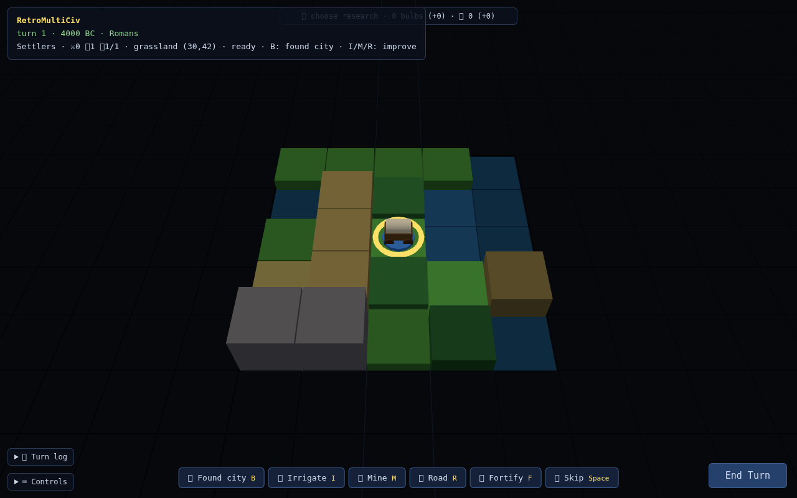

# RetroMultiCiv

A browser-based, turn-based 4X strategy game implementing classic early-4X
mechanics (in the tradition of the 1991 original) through an original,
deterministic simulation engine, architected for a mechanical
module-by-module port to Roblox Luau. "Multi" as in multiplayer — and
multiple implementations.



- Browser client: three.js low-poly renderer (flat tile boxes + raycast picking) behind a renderer interface — three pinned to r162 so WebGL1-only browsers still render
- Backend: Node.js (minimal deps), authoritative from phase 3
- One pure, deterministic game engine shared by every phase
- Default world: 80×50, east–west wrapping (Civ 1 size)

## Documentation

| Doc | Contents |
|---|---|
| [docs/01-game-spec.md](docs/01-game-spec.md) | Game rules: map, cities, units, combat, full Civ 1 tech tree, wonders, governments, AI, victory |
| [docs/02-architecture.md](docs/02-architecture.md) | Engine-as-reducer design, repo layout, tech stack, Lua-portability rules, network protocol, Roblox port shape |
| [docs/03-roadmap.md](docs/03-roadmap.md) | Five development phases: single-player → hotseat → authoritative backend → LAN multiplayer → Roblox port |
| [docs/04-phase1-enrichments.md](docs/04-phase1-enrichments.md) | Designs for the remaining Civ 1 systems (happiness, governments, transforms, goody huts…) with state shapes and hash-impact notes |
| [specs/](specs/) | The designer ally's reference documents (original "Project Founders" spec, gameplay-loop review, asset plan, plan feedback) — kept verbatim; adopted ideas are merged into the docs above |

## Requirements

- Node.js 20+ (tests and tools; no npm dependencies)
- Any static file server for the client (`python3 -m http.server` shown below)
- A browser with WebGL — WebGL1 suffices (three.js is pinned to r162 for that);
  append `?diag=1` to the game URL for a graphics diagnostics panel

## Running

```bash
# play: serve the repo root (client imports engine/ and data/ as siblings)
python3 -m http.server 8123
# then open http://localhost:8123/client/ — the setup screen picks
# civilizations, human players (hotseat), the world seed, and the
# starting age (Ancient → Space Age: the world fast-forwards under AI
# and you take over) — ?seed=12345&civs=3&humans=2&age=renaissance
# skips straight into that game

# run the test suite (headless, no deps)
node --test test/

# regenerate ruleset data from the wiki extraction
node tools/mapdata.js
# re-extract wiki stat tables (needs the dump, see below)
node tools/wiki2data.js ../wikiteam/civ_articles_only/*-current.xml data/wiki-extract
```

## Data source

Ruleset numbers (unit stats, tech tree, wonders, terrain yields) are verified
against a local wikiteam XML dump of the Civilization Fandom wiki, expected at
`../wikiteam/civ_articles_only/` (sibling of this repo, not committed).
`tools/wiki2data.js` extracts the key Civ 1 pages into `data/wiki-extract/`,
which is **gitignored**: the raw extraction contains CC BY-SA 3.0 prose from
the wiki and stays out of this MIT repo — regenerate it locally when needed.
The committed `data/*.json` rulesets hold game statistics (facts) structured
for this engine. Tests that need the dump or extraction self-skip without them.

## Status

Phase 1 is playable: seeded world generation, fog of war, unit movement,
city founding/growth/production, Civ 1 one-shot combat (stack death, veterans,
zone of control, city capture with plunder), and barbarians — all in the
browser against the real engine. Select a unit, explore, press B to found a
city, 1/2/3 to set production, attack by clicking adjacent enemies, E to end
turns. Research is live (all 68 Civ 1 advances — click the research bar for
the full panel), buildings & wonders too (all 21 of each, working effects,
wonder race). Cities have a full city view: production catalog, yields and
growth/production forecasts, population badges on the map, and a clickable
worked-tile map for manual worker placement (optimize food, shields, or trade
per city). Founding prompts for a name from your civilization's historic city
list. **AI opponents** explore, settle, defend, and attack under their own
fog of war; **victory conditions** (conquest or score at 2100 AD, with a
victory/defeat banner); and **save/load** — F5/F9 for quick browser saves,
Shift+S to download a JSON save file, Shift+L or drag-and-drop to load one.
For bug reports there's something better: **Shift+D downloads a replayable
diagnostics recording** (your commands + state hashes), and
`node tools/replay.js <file>` re-runs the whole game through the engine to
verify — or pinpoint — exactly what happened. Start a bigger game with
`?civs=3` (up to 14 — larger maps seat more civilizations). The UI explains itself: hovering an enemy shows a
**combat odds preview** with the multiplier breakdown, a selected settler
rates the hovered tile as a city site and projects its footprint on the map,
the production catalog shows per-item build times, plain-language effects,
and what technology unlocks the locked entries, and a collapsible **turn log**
narrates growth, completions, discoveries, wonder news, first contacts, and
every battle. Settlers work the land, too: irrigate, mine, or build roads
(Civ 1 rules — irrigation needs a water source, mined hills yield +3 shields,
roads speed movement and add trade on open terrain). A bottom-center
**action bar** lists the selected unit's applicable actions with their
hotkeys; impossible actions explain themselves in a center message, the
research bar shows gold and bulbs with per-turn deltas, and ending the turn
with units still to move asks for a confirming second press. The first
low-poly art kit is in: covered-wagon settlers, spear-carrying infantry,
horses, siege engines and tanks, sailing and powered ships, aircraft —
all with ownership as a colored base disc — plus cities that grow as house
clusters (owner-colored roofs, banner, walls once City Walls is built),
trees on forests and jungles, and on-map markers for irrigation, mines,
roads, and special resources.
**Phase 1 complete: a full, winnable game vs AI.**
Cities can **rush-buy** production for gold, units can pillage and disband,
and the city view pages through your empire with ‹ › arrows (or ←/→).
Citizens now have moods: keep them content with luxuries, entertainers,
temples, and martial law, or watch a city fall into **civil disorder**;
**governments** run from Despotism to Democracy (revolutions included,
with rate caps, unit upkeep, war weariness, and corruption that grows with
distance from your Palace); and settlers clear forests, drain swamps,
plant woods, raise **fortresses**, and lay **railroads**.
**Phase 2 hotseat is in**: a bare URL opens the game-setup screen
(civilizations, human players, seed), and with two or more humans the game
passes the keyboard between turns behind a fully opaque hand-off screen —
each player sees only their own fog of war, through the exact per-player
view filter the multiplayer server will use later.
Pick from the **full Civ 1 roster of 14 civilizations**, each with a
historic city list and a light specialty (Roman legions cost less, Zulu
militia are born veterans, Babylonians start with Alphabet, Aztec
tribute gold…); opponents are drawn seed-deterministically, so a URL still
reproduces the exact game. And the world got its first procedural terrain
detail pass: shade-varied tiles, scattered forests, rocky hills,
snow-capped peaks, ground scrub, and roads that visibly connect to
neighboring roads and cities.
226 headless tests including hash-locked JSON scenarios, an AI-determinism
lock, and real-browser e2e runs that boot the client, inspect the live
panels, verify the hotseat hand-off, and play a turn through the
authoritative server over a WebSocket. The optional Node server
(`node server/index.js`, then open the client with `?server=1`) now runs the
same engine authoritatively: the browser becomes a thin client that sends
commands and renders the per-player filtered views the server pushes, with
save/resume and reconnect on the server side. **LAN multiplayer is in and
accepted**: host with `./run.sh` (or `run.ps1` on Windows), friends join by
a 5-letter code, pick seats and civilizations in the host's waiting room,
spectators can watch — and a real two-machine session survived a network
cut plus a server restart with save-resume, replaying hash-for-hash.
Next: the Roblox Luau port of the engine, verified by those same replays.

This game is built AI-assisted (Claude Code) with a human designer and a WebGL
specialist contributing reviews. The full development prompt log is kept
locally and will be published, curated, with the 1.0 release.

## License

[MIT](LICENSE). Vendored [three.js](https://threejs.org) is MIT (see LICENSE
for the notice).

RetroMultiCiv is an unofficial fan project inspired by the 1991 game
*Sid Meier's Civilization*. It is not affiliated with, endorsed by, or
connected to Take-Two Interactive, Firaxis Games, or MicroProse.
"Civilization" is a trademark of Take-Two Interactive Software, Inc.
No original game assets, code, or content are used.
