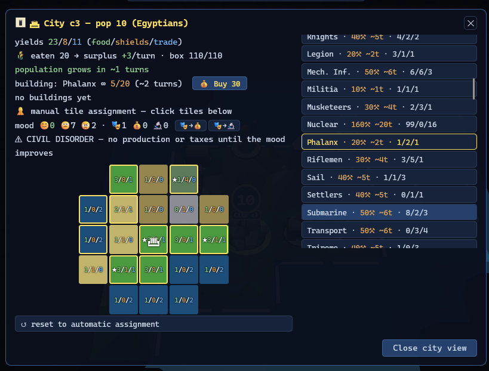

# RetroMultiCiv

A browser-based, turn-based 4X strategy game implementing classic early-4X
mechanics (in the tradition of the 1991 original) through an original,
deterministic simulation engine, architected for a mechanical
module-by-module port to Roblox Luau. "Multi" as in multiplayer — and
multiple implementations.


- Browser client: three.js low-poly renderer (flat tile boxes + raycast picking) behind a renderer interface — three pinned to r162 so WebGL1-only browsers still render
- Backend: Node.js (minimal deps), authoritative from phase 3
- One pure, deterministic game engine shared by every phase
- Default world: 80×50, east–west wrapping (Civ 1 size)

## Host your own server

No build step, one dependency (`ws`), no database. Get Node LTS, clone, and:

```bash
npm ci && ./run.sh          # → http://localhost:8123/client/?server=1
```

Or with Docker:

```bash
docker run --rm -p 8123:8123 $(docker build -q .)
```

Full guide — systemd, a public Hetzner VM with nginx + Let's Encrypt TLS (incl.
the `/ws` WebSocket upgrade block), and a Raspberry Pi section — is in
**[docs/how-to-host.md](docs/how-to-host.md)**.

## Documentation

| Doc | Contents |
|---|---|
| [docs/01-game-spec.md](docs/01-game-spec.md) | Game rules: map, cities, units, combat, full Civ 1 tech tree, wonders, governments, AI, victory |
| [docs/02-architecture.md](docs/02-architecture.md) | Engine-as-reducer design, repo layout, tech stack, Lua-portability rules, network protocol, Roblox port shape |
| [docs/03-roadmap.md](docs/03-roadmap.md) | The development phases: single-player → hotseat → authoritative backend → LAN multiplayer → Roblox port (all complete) → diplomacy (designed) |
| [docs/04-phase1-enrichments.md](docs/04-phase1-enrichments.md) | Designs for the remaining Civ 1 systems (happiness, governments, transforms, goody huts…) with state shapes and hash-impact notes |
| [docs/05-simulation-test.md](docs/05-simulation-test.md) | The headless all-AI simulation harness: chaos injection, invariants, golden checkpoint hashes |
| [docs/06-phase3-server.md](docs/06-phase3-server.md) | Authoritative server: protocol, seats, tokens, per-player views, persistence |
| [docs/07-game-code.md](docs/07-game-code.md) | The save-tamper verification code (the 5-letter-group game code) |
| [docs/08-phase4-lan.md](docs/08-phase4-lan.md) | LAN multiplayer: lobby, join codes, skip-vote, kick, seat codes, AI regency |
| [docs/09-phase5-luau.md](docs/09-phase5-luau.md) | The Luau port: trap ledger, port order and gates, cross-language verification contract |
| [docs/how-to-host.md](docs/how-to-host.md) | Host your own server: quick start, systemd, Docker, a public Hetzner VM with nginx + TLS, Raspberry Pi |
| [docs/12-global-host.md](docs/12-global-host.md) | Public hosting design: hosted games + a QuakeWorld-style master index (future) |
| [docs/13-roblox-ui-parity.md](docs/13-roblox-ui-parity.md) | The Roblox client roadmap: every browser UI element's Roblox representation, in tiers |
| [docs/14-phase6-diplomacy.md](docs/14-phase6-diplomacy.md) | Phase 6 design: Civ 1-scale treaties, leader audiences, reputation + senate, human treaties in LAN |
| [specs/](specs/) | The designer ally's reference documents (original "Project Founders" spec, gameplay-loop review, asset plan, plan feedback rounds) — kept verbatim; adopted ideas are merged into the docs above |

## Requirements

- Node.js 20+ (tests and tools; no npm dependencies)
- Any static file server for the client (`python3 -m http.server` shown below)
- A browser with WebGL — WebGL1 suffices (three.js is pinned to r162 for that);
  append `?diag=1` to the game URL for a graphics diagnostics panel

## Running

```bash
# play: serve the repo root (client imports engine/ and data/ as siblings)
python3 -m http.server 8123
# then open http://localhost:8123/client/ — the setup screen picks
# civilizations, human players (hotseat), the world seed, and the
# starting age (Ancient → Space Age: the world fast-forwards under AI
# and you take over) — ?seed=12345&civs=3&humans=2&age=renaissance
# skips straight into that game

# run the test suite (headless, no deps)
node --test test/

# regenerate ruleset data from the wiki extraction
node tools/mapdata.js
# re-extract wiki stat tables (needs the dump, see below)
node tools/wiki2data.js ../wikiteam/civ_articles_only/*-current.xml data/wiki-extract
```

## Data source

Ruleset numbers (unit stats, tech tree, wonders, terrain yields) are verified
against a local wikiteam XML dump of the Civilization Fandom wiki, expected at
`../wikiteam/civ_articles_only/` (sibling of this repo, not committed).
`tools/wiki2data.js` extracts the key Civ 1 pages into `data/wiki-extract/`,
which is **gitignored**: the raw extraction contains CC BY-SA 3.0 prose from
the wiki and stays out of this MIT repo — regenerate it locally when needed.
The committed `data/*.json` rulesets hold game statistics (facts) structured
for this engine. Tests that need the dump or extraction self-skip without them.

## Status — v0.5

**The full game, in the browser.** A complete, winnable classic-4X
game against AI opponents: seeded 80×50 worlds with fog of war, all 28
units / 21 buildings / 21 wonders / 68 advances, Civ 1 one-shot combat
(veterans, zone of control, stack death, city capture), citizen moods
and civil disorder, governments from Despotism to Democracy
(revolutions, corruption, war weariness), land improvement through
railroads and terrain transforms, barbarians, and victory by conquest
or score at 2100 AD. Pick any of the **14 classic civilizations**
(historic city lists, light specialties), start in any age from
Ancient to Space (the world fast-forwards under AI and you take over),
and tune difficulty from Trainer to God-Emperor. The UI explains
itself — combat odds with the multiplier breakdown, city-site ratings,
per-item build times and unlock reasons, a narrated turn log, map
overlays (city influence, forces) — in an original low-poly art style
with animated flags, gliding units, and a living title-screen diorama.



**Multiplayer, accepted for real.** Hotseat behind an opaque hand-off
screen; or host a LAN game with `./run.sh` (or `run.ps1`) — friends
join by a 5-letter code, pick seats and civilizations in a lobby with
chat and host moderation, spectators can watch, and every seat gets a
private code for rejoining from any device. Disconnects reconnect;
an **AI regent** can play your seat while you step away; the server
autosaves and resumes. The acceptance test was physical: a real
two-machine session survived a network cut AND a server kill with
save-resume, replaying hash-for-hash.

**The Roblox port is complete and verified.** The entire deterministic
engine — every rule, world generation, and the AI itself — runs in
Luau and provably matches the JavaScript engine: identical canonical
state hashes across ten pinned replay scenarios, full 400-turn AI
games, and real recorded sessions, verified on three machines. The
acceptance test was *played*, not just run: a 36-turn game inside
Roblox Studio whose command log replays hash-exact through the browser
engine (the artifact lives in `roblox/acceptance/`). Next: deepening
the in-Roblox client (city panels, avatar unit-possession) along the
[docs/13](docs/13-roblox-ui-parity.md) parity tiers.

**Determinism is the whole architecture.** One pure engine, state as
plain data, every random draw seeded and ordered. 523 headless tests
including hash-locked replay scenarios, an AI-determinism lock, and
real-browser e2e runs; a nightly CI soak plays 50 full AI games. Every
game can prove itself: **Shift+D downloads a replayable recording**,
and `node tools/replay.js <file>` re-runs it through the engine to
verify — or pinpoint — exactly what happened.

This game is built AI-assisted (Claude Code) with a human designer and a WebGL
specialist contributing reviews. The full development prompt log is kept
locally and will be published, curated, with the 1.0 release.

## License

[MIT](LICENSE). Vendored [three.js](https://threejs.org) is MIT (see LICENSE
for the notice).

RetroMultiCiv is an unofficial fan project inspired by the 1991 game
*Sid Meier's Civilization*. It is not affiliated with, endorsed by, or
connected to Take-Two Interactive, Firaxis Games, or MicroProse.
"Civilization" is a trademark of Take-Two Interactive Software, Inc.
No original game assets, code, or content are used.
