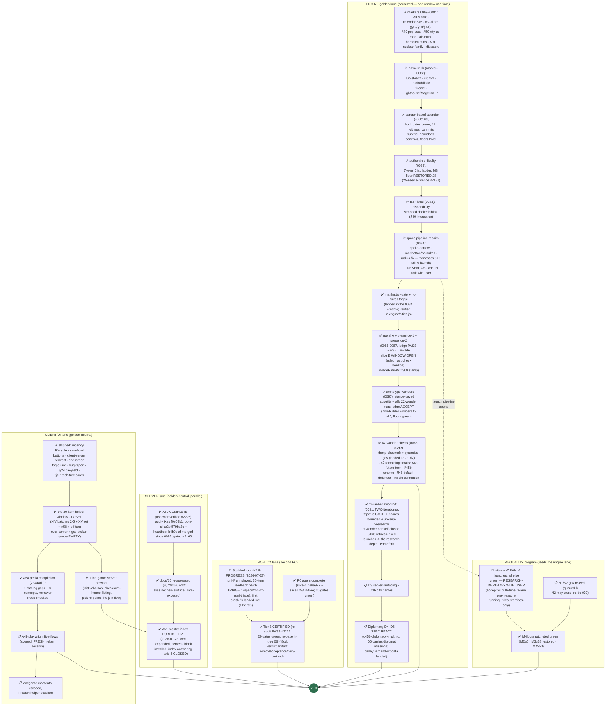

# RetroMultiCiv — road to v1.0: remaining work, as a dependency tree

_LIVING DOCUMENT (user ruling 2026-07-20): kept current as markers land —
update the node statuses + "last updated" line with each marker report, and
re-verify against the engine (not the workitem files) when an axis flips to
done. Companion: `plan-version2.md` (the v2.0-or-later shelf).
Last updated: 2026-07-23 late night (marker-0091 TAGGED @03a8732 =
candidate, 23rd consecutive — #30 SUCCESS: unit tripwire GONE, hoards
bounded, freed upkeep -> research, and the archetype wonder bar
SELF-CLOSED 44%->64%. Also in 0091: the shared/version.js integrity
fix + tracked-imports guard (hardening catch — clean-clone server
boot was broken 5 markers, ~96 fails re-attributed) + XV fully closed
(server-save merge). THE ONE OPEN FORK (user): witness-7 = 0 launches
with everything else green — residual is RESEARCH DEPTH alone; accept
authentically-contested space vs bulb-tune; a 3-arm rulesOverrides
pre-measure runs on sim-runner so the ruling lands on data. Axis 5
CLOSED (index LIVE). Studded round-2 played (runI, full 2100AD game,
tiers 1-3 accepted; sound/saving = publish gate) -> 26-item batch
triaged + rulings delivered. Engine order: invade-B [WINDOW OPEN] ->
regent-stall HIGH bug #37 -> perf profile #15 [WIDENED: browser ff
3min-to-150AD @14civ + roblox industrial —
chunking + baker land client-side in parallel] -> gov-reeval -> XV-engine + smalls ->
D3-surfacing -> D4-D6.)
Source of truth for the 1.0 definition: `docs/03-roadmap.md` § "The 1.0
definition" (user-ruled, maximal cut). Status legend: ✅ done · 🔨 in
flight right now · 📋 queued (owner known) · 🧩 designed, not started ·
🚪 user gate._

The single most important structural fact: **every engine/gamesim change
serializes through ONE golden window** (one lock-holder at a time, JS+Luau
twins re-recorded together). The left spine below is therefore a queue, not a
set of parallel tracks. Server, client-UI, and Roblox work run in parallel
because they are golden-neutral.

## What "done" already covers (no v1 work left)

Naval systems + naval TRUTH rules, air movement + air-truth rules, goody
huts (A4), caravan wonder-help (A83) AND trade routes (A89), unit
obsolescence/upgrades (A63), building sell (A86), era-scaled barbarians
(A66) + barbarian SEA RAIDS with the sails telegraph, AI leaders (A59),
the full A91 nuclear family (pollution · warming · meltdown · detonation),
the 8 Civ1 disasters (authentic-ON + toggle), settler pop-cost (§40),
city-as-road (§50), space race content (A76) with the XII.5b project AI +
danger-based abandon, the 7-level authentic difficulty ladder (landing),
debug surface (A92), map types (A82a), sound, tech tree + glyphs,
diplomacy D1–D3, crash resilience + ws-timeout, /healthz + invite
throttle, public hosting on the test box with TLS + hardened posture, the
master-index CODE (announce protocol + probe + `badAddress` guard, tested).

## The six 1.0 axes, scored

| # | 1.0 axis (user ruling) | State | Remaining |
|---|---|---|---|
| 1 | Every Civ 1 system faithful | ~98% (A7 ✅, pyramids-gov ✅, §7 client ✅) | A6a future-tech, A8 tile contention, §45b rehome, §46 default-defender, §7 engine-half (#21) |
| 2 | Diplomacy FULL D1–D6 | D1–D3 ✅, parley data landed, UN effect spec'd into D5 | **D4–D6** (human LAN treaties, senate, reputation) — spec ready, the engine-queue tail |
| 3 | AI at M-targets | archetype ✅ (bar self-closed 64%), #30 ✅ SUCCESS | **the research-depth fork (user, data incoming)**, invade B (in build), regent-stall #37, gov re-eval, §11 disorder |
| 4 | Roblox Tier 3 multiplayer | CERTIFIED + R6 + SO18; round-2 IN PROGRESS | **runI 26-item batch** (roblox-helper, blockers first) + sound/saving (test-publish gate) |
| 5 | Public hosting + master index | ✅ COMPLETE + LIVE (box step done 07-23) | — (server self-lists on next redeploy) |
| 6 | Maps/sound/pedia/advisor/CI | advisor ✅, A58 ✅ (0 gaps, cross-checked) | A49 playwright lane (scoped, needs a FRESH helper session), endgame-moments (same) |

## Reading the tree — the three facts that matter

1. **The engine spine is the critical path**: invade-B (window OPEN) →
   regent-stall #37 (HIGH — the runI hang, likely shared) →
   pollution-perf #15 (promoted — the Roblox industrial-age suspect;
   both platforms gain) → gov-reeval → §7-engine + §11-disorder (user's
   lux playbook) → smalls (A6a/A8/rehome/default-defender) →
   D3-surfacing → D4–D6. The whole AI-quality program is otherwise
   DONE: floors green, archetype accepted, #30 succeeded.
2. **One design fork + two user gates remain:** the research-depth
   fork (accept vs bulb-tune — data incoming from the 3-arm
   pre-measure), the redeploy (0091 = the candidate; the server
   self-lists in Find game on it), and finishing the Roblox round-2
   loop (the 26-item batch is agent-side; sound/saving await your
   test-publish). Plus the fresh helper session for the last two
   axis-6 items.
3. **No open designs remain agent-side.** D4–D6 spec ready; the runI
   batch fully ruled (#2304); speed-up machinery live: baseline
   banking (halves every judge), rulesOverrides pre-measurement (forks
   arrive with data), and the age-snapshot baker (Roblox fast starts).

_Not in v1 (user-ruled v2 shelf): dedicated mobile UI, Civ4-style culture,
novelty map shapes, checkpointed saves, Blender/glTF fidelity pass, the
Civ2-ruleset game option, cross-play bridge, negotiation layer, rename
program. The XIV mobile items above are UX fixes to the existing client,
not the v2 mobile UI._
