# RetroMultiCiv — road to v1.0: remaining work, as a dependency tree

_LIVING DOCUMENT (user ruling 2026-07-20): kept current as markers land —
update the node statuses + "last updated" line with each marker report, and
re-verify against the engine (not the workitem files) when an axis flips to
done. Companion: `plan-version2.md` (the v2.0-or-later shelf).
Last updated: 2026-07-25 morning (marker-0101 TAGGED @c51dceb =
MERGE-CONSISTENT + REDEPLOY candidate, clean-clone --full GREEN
886/0-fail, supersedes 0097–0100; luau pin 0xd4151d33 unchanged
across FOUR markers — everything since 0097 is engine-golden-neutral.
0101 closes **refinement-XVII COMPLETE** (all 22 items: 18-item
client batch + join-toggle both halves) + runK roblox batch +
tooling fixes (ack-parser hash bug, reaper cooldown, watcher
deployed+verified). RC PREP BANKED: reports/v1-rc-draft.md (axes
pre-filled) + specs/readme-v1-draft.md (ally blocks framed,
title-swappable). Remaining v1 = the engine spine (A8 threading
[kit banked] -> coastal-build -> RIVER -> D3-surfacing -> D4-D6,
+ workturns/transforms companion, fact-check #2465 banked) +
Founder's Record (fresh helper session) + the Studio
publish/acceptance session. USER: redeploy 0101, two fresh sessions,
roblox Write approval, Studio, trademark. 0097 carried:
#8 default-defender (behavioral, committed-goldens+PIN unmoved, gates
requested #2393) · agent-mail at-least-once upgrade · fish/specials
motifs + roblox mirror · roster-shuffle (age-snapshot instant starts
ACTIVE on Roblox) · late-join CLIENT half + join-share QR + boot-fade
+ onboarding-e2e fix · A49 flow-2 (flow-4 rides Founder's Record).
Late-join+pause+eviction: FEATURE-COMPLETE — server half MERGED
@205bbfe on reviewer green #2419 (both halves in-tree; only the
cosmetic reveal banner remains, next helper session, live dispatch).
Speed pass live: #19 DONE by hardening same evening (branch, gate
queued to reviewer) → hardening now on the docs/16 SECURITY
RE-ASSESSMENT (its own trigger: new dep + 1.0 proximity — the RC bar
wants docs/16 current); witness-8 BEFORE-half queued (sim-runner,
untaken pending its wake); D4 treaty SHELL un-gated (helper holds it
behind Founder's Record). Fleet fully stocked — the rate limiter is
the serialized engine spine + the two fresh-session starts + the
gaming-PC session wakes (turn-based sessions cannot self-start a
turn; see the Stop-hook item in specs/agent-mail-hub-upgrade.md
phase 1). Engine queue UNBLOCKED by the tag: #32 A8
(fresh bugfixer session) -> #19 view-contract -> D3-surfacing ->
D4-D6 (witness-8 + treaty-UI ride D4). Client remaining: Founder's
Record #34 (fresh helper session) + the post-join reveal banner (now
buildable — server contract live). Roblox: runI design batch part 1
built, continuing (long); publish gate after. USER: REDEPLOY FROM
0097, trademark search + domains, Studio items 4b/4c.)
Source of truth for the 1.0 definition: `docs/03-roadmap.md` § "The 1.0
definition" (user-ruled, maximal cut). Status legend: ✅ done · 🔨 in
flight right now · 📋 queued (owner known) · 🧩 designed, not started ·
🚪 user gate._

The single most important structural fact: **every engine/gamesim change
serializes through ONE golden window** (one lock-holder at a time, JS+Luau
twins re-recorded together). The left spine below is therefore a queue, not a
set of parallel tracks. Server, client-UI, and Roblox work run in parallel
because they are golden-neutral.

```mermaid
flowchart TD
  subgraph ENGINE["ENGINE golden lane (serialized — one window at a time)"]
    HIST["✅ markers 0069–0081: XII.5 core ·\ncalendar-545 · xiv-ai arc (§12/§13/§14) ·\n§40 pop-cost · §50 city-as-road · air-truth ·\nbarb sea raids · A91 nuclear family · disasters"]
    NAV2["✅ naval-truth (marker-0082):\nsub stealth · sight-2 · probabilistic\ntrireme · Lighthouse/Magellan +1"]
    DAB["✅ danger-based abandon (706b19d,\nboth gates green; 4th witness: commits\nsurvive, abandons concrete, floors hold)"]
    DIFF["✅ authentic difficulty (0083):\n7-level Civ1 ladder; M3 floor RESTORED 28\n(25-seed evidence #2181)"]
    B27["✅ B27 fixed (0083): disbandCity\nstranded docked ships (§40 interaction)"]
    APN["✅ space pipeline repairs (0084):\napollo-narrow · manhattan/no-nukes ·\nradius fix — witnesses 5+6 still 0-launch;\n🚪 RESEARCH-DEPTH fork with user"]
    ARCH["✅ archetype wonders (0090): stance-keyed\nappetite + ally 22-wonder map; judge ACCEPT\n(non-builder wonders 0->20, floors green)"]
    MAN["✅ manhattan-gate + no-nukes toggle\n(landed in the 0084 window; verified\nin engine/cities.js)"]
    NAVL["✅ naval arc COMPLETE (0085-0092):\npresence-1/2 judge PASS ~2x + invade-B +\nformal acceptance 25/25 archipelago seeds"]
    SMALL["✅ smalls CLOSED (0088-0097): A7 wonders ·\npyramids-gov · settler-refuse + rehome (0095) ·\ndisorder-lux playbook · §46 default-defender ·\nA6a future-tech (0097)"]
    XAB["✅ xiv-ai-behavior #30 (0091) + gov arc\n(0094, bloat halved) + workers>pop + COW\nmap-sharing (0096, ~38% perf byte-identical)"]
    CLM["✅ claimSeat command (0097):\nAI seat -> human via the stamped command\npath; fixture 061; unblocked late-join §3"]
    A8N["🔨 A8 tile contention — correctness PROVEN,\nparked at the perf ramp; fresh session THREADS\nthe once-per-turn assignment (kit banked)"]
    CST["📋 coastal-build (XVII §5, verified bug:\nsea units need a CENTER-adjacent coast;\ncityIsCoastal shared with the AI paths)"]
    RIV["📋 RIVER terrain (user-ruled 2026-07-25):\nthe 12th Civ1 terrain — meandering strips\n~10-12% land; specs/river-terrain.md;\nworkturns/transforms companion after"]
    D3S["📋 D3 server-surfacing · 11b city names"]
    D46["📋 Diplomacy D4–D6 — SPEC READY\n(d456-diplomacy-impl.md; witness-8 AFTER-half\n+ treaty-UI rename pass ride the D4 landing)"]
    HIST --> NAV2 --> DAB --> DIFF --> B27 --> APN --> MAN --> NAVL
    NAVL --> ARCH --> SMALL --> XAB --> CLM --> A8N --> CST --> RIV --> D3S --> D46
  end

  subgraph SERVER["SERVER lane (golden-neutral, parallel)"]
    A50R["✅ A50 COMPLETE (reviewer-verified #2225):\naudit-fixes f0e03b1; oom-slice2b 579ba2e +\nheartbeat b4b9dcd merged since 0083, gated #2165"]
    A51D["✅ A51 master index PUBLIC + LIVE\n(2026-07-23: cert expanded, servers. block\ninstalled, index answering — axis 5 CLOSED)"]
    LJS["✅ late-join+pause+eviction FEATURE-COMPLETE\n(user design 2026-07-24 -> merged @205bbfe\nsame day; --no-late-join documented)"]
    SEC2["✅ docs/16 §7 re-assessed (2026-07-24,\nnew-dep+1.0 trigger): NO RC-blocker;\ntakeover-cap residual -> v2 shelf"]
    VCT["✅ #19 view-contract test MERGED (012d04b)\n+ master-proxy + lobby-drop (reviewer green)"]
    JTG["✅ XVII §3 join-toggle merged @e00be57\n(host open/closed, AI-seat auto-fill,\nreconnect-reclaim verified) — server lane\nqueue EMPTY, all delivered"]
    A50R --> A51D --> LJS --> SEC2 --> VCT --> JTG
  end

  subgraph CLIENT["CLIENT/UI lane (golden-neutral)"]
    XIVD["✅ shipped: regency lifecycle · save/load\nbuttons · client-server redirect · endscreen\nfog-guard · bug-report · §24 tile-yield ·\n§27 tech-tree cards"]
    XIVQ["✅ the 30-item helper window CLOSED\n(XIV batches 2-5 + XV set + A58 + off-turn\nover-server + gov-picker; queue EMPTY)"]
    A58["✅ A58 pedia completion (2d4a8d1):\n0 catalog gaps + 3 concepts, reviewer\ncross-checked"]
    A49["✅ A49 flow-2 SHIPPED (0097; per-seat\nfog guards) · 📋 flow-4 rides Founder's Record"]
    LJC["✅ late-join client + reveal banner +\njoin-share QR + boot-fade + specials motifs\n+ d4-treaty-shell + play-lane sweep +\nrefinement-XVII COMPLETE (all 22, 0101)"]
    END["📋 #34 Founder's Record endgame package\n(FRESH helper session; flow-4 bundled)"]
    FG["✅ 'Find game' server browser\n(initGlobalTab: checksum-honest listing,\npick re-points the join flow)"]
    XIVD --> XIVQ --> A58 --> A49 --> END
    XIVQ --> FG
    FG --> LJC
  end

  subgraph ROBLOX["ROBLOX lane (second PC)"]
    T3["✅ Tier 3 CERTIFIED (re-audit PASS #2222:\n29 gates green, re-bake in-tree 06448dd;\nverdict artifact roblox/acceptance/tier3-cert.md)"]
    SNAP["✅ age-snapshot instant starts ACTIVE\n(matcher twin + loader + roster-shuffle\n8f0e982) · specials mirror 577086c"]
    STUD["🔨 runI batch IN BUILD (design rulings\nspecs/runI-design-rulings.md; items 12/6/5/2\nbuilt; seat-preview align queued) ·\n🚪 publish gate after (sound+saving+batch\nin ONE Studio acceptance session)"]
    R6["✅ R6 agent-complete (slice-1 de8a977 +\nslices 2-3 in-tree; 30 gates green)"]
    STUD --> T3
    R6 --> T3
    SNAP --> STUD
  end

  subgraph AIQ["AI-QUALITY program (feeds the engine lane)"]
    MFL["✅ M-floors ratcheted green\n(M2≥6 · M3≥28 restored · M4≥50)"]
    W5["✅ FORK RULED (2026-07-24): ACCEPT for v1\n— space = authentically-contested ending;\nwitness-8 re-measure queued post-D4\n(sim-runner, durable)"]
    GOV["✅ gov arc (0094): beeline + democracy-\nif-safe + upgrade-in-city; bloat HALVED"]
    W5 --> MFL
    GOV --> MFL
  end

  A51D --> V1
  T3 --> V1
  D46 --> V1
  SMALL --> V1
  MFL --> V1
  A49 --> V1
  FG --> A51D
  APN -. "launch pipeline\nopens" .-> W5
  V1(("v1.0")):::goal

  classDef goal fill:#2f6f4f,color:#fff,stroke:#2f6f4f
  classDef done fill:#d9f2e0,color:#1c4a33,stroke:#7bc09a
  class HIST,NAV2,DAB,DIFF,B27,APN,ARCH,MAN,NAVL,SMALL,XAB,CLM done
  class A50R,A51D,LJS,SEC2,VCT,JTG done
  class XIVD,XIVQ,A58,A49,LJC,FG done
  class T3,SNAP,R6 done
  class MFL,W5,GOV done
```

## What "done" already covers (no v1 work left)

Naval systems + naval TRUTH rules, air movement + air-truth rules, goody
huts (A4), caravan wonder-help (A83) AND trade routes (A89), unit
obsolescence/upgrades (A63), building sell (A86), era-scaled barbarians
(A66) + barbarian SEA RAIDS with the sails telegraph, AI leaders (A59),
the full A91 nuclear family (pollution · warming · meltdown · detonation),
the 8 Civ1 disasters (authentic-ON + toggle), settler pop-cost (§40),
city-as-road (§50), space race content (A76) with the XII.5b project AI +
danger-based abandon, the 7-level authentic difficulty ladder (landing),
debug surface (A92), map types (A82a), sound, tech tree + glyphs,
diplomacy D1–D3, crash resilience + ws-timeout, /healthz + invite
throttle, public hosting on the test box with TLS + hardened posture, the
master-index CODE (announce protocol + probe + `badAddress` guard, tested).

## The six 1.0 axes, scored

| # | 1.0 axis (user ruling) | State | Remaining |
|---|---|---|---|
| 1 | Every Civ 1 system faithful | ~97% (all smalls ✅; river ruled IN grew the axis) | **A8 threading → coastal-build → RIVER terrain** (+ workturns/transforms companion) |
| 2 | Diplomacy FULL D1–D6 | D1–D3 ✅, claimSeat ✅, treaty-UI shell un-gated | **D3-surfacing → D4–D6** (the engine-queue tail; spec ready) |
| 3 | AI at M-targets | ✅ COMPLETE for v1 (fork RULED accept; floors/archetype/#30/gov-arc/disorder shipped+measured) | witness-8 AFTER-half rides D4 (BEFORE-half queued) |
| 4 | Roblox Tier 3 multiplayer | CERTIFIED + R6 + instant age-starts ACTIVE; runI batch in build | **runI batch finish** + 🚪 the ONE publish/acceptance Studio session (sound+saving+batch) |
| 5 | Public hosting + master index | ✅ COMPLETE + LIVE (+ late-join/pause/eviction feature-complete server-side) | — (self-lists + late-join go live on the 0097 redeploy) |
| 6 | Maps/sound/pedia/advisor/CI | advisor ✅, A58 ✅, A49 flow-2 ✅ | **#34 Founder's Record** (fresh helper session; flow-4 bundled) |

## Reading the tree — the three facts that matter

1. **The engine spine is short now**: A8 (window OPEN) →
   D3-surfacing → D4–D6, and that's the whole serialized remainder.
   Everything else on the spine through marker-0097 is done and
   gated; the AI-quality program is closed (floors green, archetype
   accepted, fork ruled).
2. **Three user gates remain:** the 0097 redeploy (late-join + all of
   today's UI goes live on it), the ONE Roblox publish/acceptance
   Studio session (after the runI batch), and the fresh helper
   session for Founder's Record. Plus the standing trademark search.
3. **No open designs remain agent-side.** D4–D6 spec ready with the
   treaty-UI shell un-gated against provisional names; the runI batch
   fully ruled; speed machinery live: baseline banking, the witness-8
   BEFORE-half, per-dir-serialized lane-watcher for dark sessions,
   and the at-least-once mail layer under it all.

_Not in v1 (user-ruled v2 shelf): dedicated mobile UI, Civ4-style culture,
novelty map shapes, checkpointed saves, Blender/glTF fidelity pass, the
Civ2-ruleset game option, cross-play bridge, negotiation layer, rename
program. The XIV mobile items above are UX fixes to the existing client,
not the v2 mobile UI._
