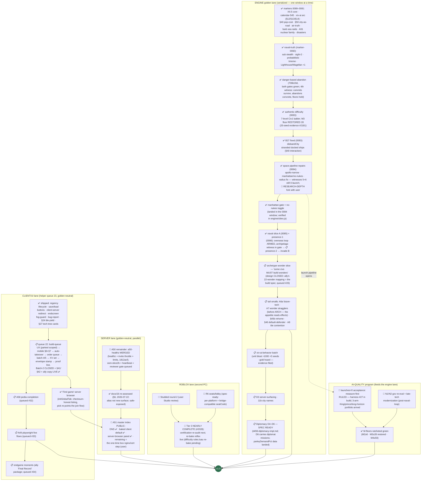

# RetroMultiCiv — road to v1.0: remaining work, as a dependency tree

_LIVING DOCUMENT (user ruling 2026-07-20): kept current as markers land —
update the node statuses + "last updated" line with each marker report, and
re-verify against the engine (not the workitem files) when an axis flips to
done. Companion: `plan-version2.md` (the v2.0-or-later shelf).
Last updated: 2026-07-22 afternoon sync (marker-0086 TAGGED @f836d4e =
candidate, 18 consecutive consistent — presence-1 ARMS the overseas loop,
advisor speaks the ally copy, master index PUBLIC with the baked
Find-game default + server-browser panel verified end-to-end. All four
release forks RULED: space = measure-first · scope = maximal ·
§7 = Civ2-refuse · DNS = servers.multiciv.kjell.today (record in; one
box step remains, user). SPACE ARC mechanically closed (witnesses 1–6 +
dig + radius migration all verified); sole blocker = RESEARCH DEPTH —
the measure-first harness (#27) is in build, the 3-arm
King/prince/long-horizon portfolio armed on sim-runner. Archetype design
CLOSED: the ally's 22-wonder mapping is the build spec. Engine order:
measure-first harness → presence-2 [M4] → invade B → A7 stragglers →
archetype → smalls → xiv-ai-behavior → D3-surfacing → D4–D6.)
Source of truth for the 1.0 definition: `docs/03-roadmap.md` § "The 1.0
definition" (user-ruled, maximal cut). Status legend: ✅ done · 🔨 in
flight right now · 📋 queued (owner known) · 🧩 designed, not started ·
🚪 user gate._

The single most important structural fact: **every engine/gamesim change
serializes through ONE golden window** (one lock-holder at a time, JS+Luau
twins re-recorded together). The left spine below is therefore a queue, not a
set of parallel tracks. Server, client-UI, and Roblox work run in parallel
because they are golden-neutral.

## What "done" already covers (no v1 work left)

Naval systems + naval TRUTH rules, air movement + air-truth rules, goody
huts (A4), caravan wonder-help (A83) AND trade routes (A89), unit
obsolescence/upgrades (A63), building sell (A86), era-scaled barbarians
(A66) + barbarian SEA RAIDS with the sails telegraph, AI leaders (A59),
the full A91 nuclear family (pollution · warming · meltdown · detonation),
the 8 Civ1 disasters (authentic-ON + toggle), settler pop-cost (§40),
city-as-road (§50), space race content (A76) with the XII.5b project AI +
danger-based abandon, the 7-level authentic difficulty ladder (landing),
debug surface (A92), map types (A82a), sound, tech tree + glyphs,
diplomacy D1–D3, crash resilience + ws-timeout, /healthz + invite
throttle, public hosting on the test box with TLS + hardened posture, the
master-index CODE (announce protocol + probe + `badAddress` guard, tested).

## The six 1.0 axes, scored

| # | 1.0 axis (user ruling) | State | Remaining |
|---|---|---|---|
| 1 | Every Civ 1 system faithful | ~94% (manhattan-gate ✅, B27 ✅) | A6a future-tech repeats, A7 wonder stragglers, A8 tile contention, §45b rehome, §46 default-defender |
| 2 | Diplomacy FULL D1–D6 | D1–D3 ✅, parley data landed | **D4–D6** (human LAN treaties, senate, reputation) — spec ready, after the engine queue drains |
| 3 | AI at M-targets | floors green, overseas loop ARMED | **King-portfolio verdict (launches — the space acceptance)**, presence-2 + invade B, archetype wonder slice, xiv-ai-behavior (bloat/hoard), gov re-eval |
| 4 | Roblox Tier 3 multiplayer | Tiers 0–3 effectively ✅ | certification re-audit; difficulty rules re-bake commit; Studded round-2 on user review; R6 build |
| 5 | Public hosting + master index | DNS ✅, baked default ✅, browser ✅ | **user one-time box nginx/cert step**, oom-slice2b + heartbeat merges |
| 6 | Maps/sound/pedia/advisor/CI | advisor ✅ with ally copy | A58 pedia completion (+4 flagged gaps), A49 playwright lane (queued #33) |

## Reading the tree — the three facts that matter

1. **The engine spine is the critical path and its order is fully ruled**:
   measure-first harness (#27, in build) → presence-2 → invade B → A7
   stragglers → archetype → smalls → xiv-ai-behavior → D3-surfacing →
   D4–D6. The space arc is mechanically CLOSED (six witnesses + dig +
   radius migration); the King-portfolio verdict is the acceptance
   measurement and runs in PARALLEL on the gaming PC — it does not block
   the spine.
2. **Only two hard user gates remain besides marker merges/redeploys:**
   the one-time box nginx/cert step (axis 5) and the Roblox Studio
   round-2 review (axis 4). Everything else is agent-executable in
   order, and every lane's queue is stocked to v1.
3. **No open designs remain.** The archetype spec closed with the
   ally's 22-wonder mapping; D4–D6 spec is ready
   (d456-diplomacy-impl.md); client/server/roblox lanes are fully
   specced and queue-fed.

_Not in v1 (user-ruled v2 shelf): dedicated mobile UI, Civ4-style culture,
novelty map shapes, checkpointed saves, Blender/glTF fidelity pass, the
Civ2-ruleset game option, cross-play bridge, negotiation layer, rename
program. The XIV mobile items above are UX fixes to the existing client,
not the v2 mobile UI._
