# RetroMultiCiv — road to v1.0: remaining work, as a dependency tree

_LIVING DOCUMENT (user ruling 2026-07-20): kept current as markers land —
update the node statuses + "last updated" line with each marker report, and
re-verify against the engine (not the workitem files) when an axis flips to
done. Companion: `plan-version2.md` (the v2.0-or-later shelf).
Last updated: 2026-07-25 night (marker-0103 TAGGED @fe39360 =
MERGE-CONSISTENT, SUPERSEDES 0102 — merge 0103. The RIVER arc ran its
full loop IN ONE EVENING: landed @8da9029 → sweep breach → audit
(mine-lock mechanism) → fix-A @ea6c2a3 (hills never flagged, 2nd
honest re-record, reviewer GREEN #2593) → post-fix sweep 16/16
clean (#2615) → USER RULING: M3-pop floor re-pinned 28→22 (flood
residual, re-ratchets at the doctrine window). ALSO in 0103: d3
endscreen-winner view contract (gameOver+winner in views at
gameOver, reviewer GREEN #2604), lobby-robustness + docs/16 §8
merges, the seven-item helper batch (founders-tone, silhouettes,
play-on-roblox, pedia-splash w/ PEDIA_NAME=Encyclopedia RULED,
guard-1c, river shots, flow4-endscreen → guards G1-G5 COMPLETE +
A49 5/5), roblox intro v1 USER-APPROVED @v5b + midgame-join landed
+ runN reset architecture, the license sweep, and the RC digest
drift-fixes. Report: reports/marker-0103.md. Spine now: **11b
authentic rosters (user RULED GO — window OPEN)** → D3-surfacing
remainder → D4-D6 → the XX §3 doctrine window. USER: merge 0103 +
redeploy, roblox/** standing Write allowlist, Studio session,
trademark.)
Source of truth for the 1.0 definition: `docs/03-roadmap.md` § "The 1.0
definition" (user-ruled, maximal cut). Status legend: ✅ done · 🔨 in
flight right now · 📋 queued (owner known) · 🧩 designed, not started ·
🚪 user gate._

The single most important structural fact: **every engine/gamesim change
serializes through ONE golden window** (one lock-holder at a time, JS+Luau
twins re-recorded together). The left spine below is therefore a queue, not a
set of parallel tracks. Server, client-UI, and Roblox work run in parallel
because they are golden-neutral.

```mermaid
flowchart TD
  subgraph ENGINE["ENGINE golden lane (serialized — one window at a time)"]
    HIST["✅ markers 0069–0081: XII.5 core ·\ncalendar-545 · xiv-ai arc (§12/§13/§14) ·\n§40 pop-cost · §50 city-as-road · air-truth ·\nbarb sea raids · A91 nuclear family · disasters"]
    NAV2["✅ naval-truth (marker-0082):\nsub stealth · sight-2 · probabilistic\ntrireme · Lighthouse/Magellan +1"]
    DAB["✅ danger-based abandon (706b19d,\nboth gates green; 4th witness: commits\nsurvive, abandons concrete, floors hold)"]
    DIFF["✅ authentic difficulty (0083):\n7-level Civ1 ladder; M3 floor RESTORED 28\n(25-seed evidence #2181)"]
    B27["✅ B27 fixed (0083): disbandCity\nstranded docked ships (§40 interaction)"]
    APN["✅ space pipeline repairs (0084):\napollo-narrow · manhattan/no-nukes ·\nradius fix — witnesses 5+6 still 0-launch;\n🚪 RESEARCH-DEPTH fork with user"]
    ARCH["✅ archetype wonders (0090): stance-keyed\nappetite + ally 22-wonder map; judge ACCEPT\n(non-builder wonders 0->20, floors green)"]
    MAN["✅ manhattan-gate + no-nukes toggle\n(landed in the 0084 window; verified\nin engine/cities.js)"]
    NAVL["✅ naval arc COMPLETE (0085-0092):\npresence-1/2 judge PASS ~2x + invade-B +\nformal acceptance 25/25 archipelago seeds"]
    SMALL["✅ smalls CLOSED (0088-0097): A7 wonders ·\npyramids-gov · settler-refuse + rehome (0095) ·\ndisorder-lux playbook · §46 default-defender ·\nA6a future-tech (0097)"]
    XAB["✅ xiv-ai-behavior #30 (0091) + gov arc\n(0094, bloat halved) + workers>pop + COW\nmap-sharing (0096, ~38% perf byte-identical)"]
    CLM["✅ claimSeat command (0097):\nAI seat -> human via the stamped command\npath; fixture 061; unblocked late-join §3"]
    A8N["✅ A8 tile contention (0102, fork-b 376ff03):\nonce-per-turn resolution, AI evals keep the\npre-A8 model (ruling); perf 0.53×; sweep GREEN"]
    CST["✅ coastal-build (0102, 95261a1): sea units\nrequire a center-coastal city; cityIsCoastal\nshared helper; scenario 064"]
    RIV["✅ RIVER COMPLETE (0103 @fe39360): landed +\nfix-A + sweep clean; M3 floor re-pinned 22 by\nUSER RULING (flood residual; re-ratchets at the\ndoctrine window)"]
    D3S["📋 D3 server-surfacing · 11b city names"]
    D46["📋 Diplomacy D4–D6 — SPEC READY\n(d456-diplomacy-impl.md; witness-8 AFTER-half\n+ treaty-UI rename pass ride the D4 landing)"]
    HIST --> NAV2 --> DAB --> DIFF --> B27 --> APN --> MAN --> NAVL
    NAVL --> ARCH --> SMALL --> XAB --> CLM --> A8N --> CST --> RIV --> D3S --> D46
  end

  subgraph SERVER["SERVER lane (golden-neutral, parallel)"]
    A50R["✅ A50 COMPLETE (reviewer-verified #2225):\naudit-fixes f0e03b1; oom-slice2b 579ba2e +\nheartbeat b4b9dcd merged since 0083, gated #2165"]
    A51D["✅ A51 master index PUBLIC + LIVE\n(2026-07-23: cert expanded, servers. block\ninstalled, index answering — axis 5 CLOSED)"]
    LJS["✅ late-join+pause+eviction FEATURE-COMPLETE\n(user design 2026-07-24 -> merged @205bbfe\nsame day; --no-late-join documented)"]
    SEC2["✅ docs/16 §7 re-assessed (2026-07-24,\nnew-dep+1.0 trigger): NO RC-blocker;\ntakeover-cap residual -> v2 shelf"]
    VCT["✅ #19 view-contract test MERGED (012d04b)\n+ master-proxy + lobby-drop (reviewer green)"]
    JTG["✅ XVII §3 join-toggle merged @e00be57\n(host open/closed, AI-seat auto-fill,\nreconnect-reclaim verified)"]
    GOR["✅ gameover-reveal + reject-reasons (0102) +\nlobby-robustness + docs/16 §8 delta + the\nendscreen-winner view contract ALL MERGED (0103)\n— server lane queue EMPTY"]
    A50R --> A51D --> LJS --> SEC2 --> VCT --> JTG --> GOR
  end

  subgraph CLIENT["CLIENT/UI lane (golden-neutral)"]
    XIVD["✅ shipped: regency lifecycle · save/load\nbuttons · client-server redirect · endscreen\nfog-guard · bug-report · §24 tile-yield ·\n§27 tech-tree cards"]
    XIVQ["✅ the 30-item helper window CLOSED\n(XIV batches 2-5 + XV set + A58 + off-turn\nover-server + gov-picker; queue EMPTY)"]
    A58["✅ A58 pedia completion (2d4a8d1):\n0 catalog gaps + 3 concepts, reviewer\ncross-checked"]
    A49["✅ A49 ALL FIVE FLOWS specced (0103):\nflow-4 = test-ui/endscreen.spec.js, doubles\nas regression-guard 3"]
    LJC["✅ late-join client + reveal banner +\njoin-share QR + boot-fade + specials motifs\n+ d4-treaty-shell + play-lane sweep +\nrefinement-XVII (0101) + XIX 8/8 (0102)"]
    END["✅ #34 Founder's Record + founders-tone +\nsilhouettes + play-on-roblox + pedia-splash\n(Encyclopedia) ALL SHIPPED (0103); guards\nG1-G5 complete; helper queue: oasis-palm"]
    FG["✅ 'Find game' server browser\n(initGlobalTab: checksum-honest listing,\npick re-points the join flow)"]
    XIVD --> XIVQ --> A58 --> A49 --> END
    XIVQ --> FG
    FG --> LJC
  end

  subgraph ROBLOX["ROBLOX lane (second PC)"]
    T3["✅ Tier 3 CERTIFIED (re-audit PASS #2222:\n29 gates green, re-bake in-tree 06448dd;\nverdict artifact roblox/acceptance/tier3-cert.md)"]
    SNAP["✅ age-snapshot instant starts ACTIVE\n(matcher twin + loader + roster-shuffle\n8f0e982) · specials mirror 577086c"]
    STUD["✅ intro v1 USER-APPROVED frozen at v5b ·\nmidgame-join BUILT + landed 58f74e4 (claimSeat\nparity, toggle default on) · 🚪 Studio session:\nverify midgame-join + publish gate + set\nROBLOX_EXPERIENCE_URL after"]
    R6["✅ R6 agent-complete (slice-1 de8a977 +\nslices 2-3 in-tree; 30 gates green)"]
    STUD --> T3
    R6 --> T3
    SNAP --> STUD
  end

  subgraph AIQ["AI-QUALITY program (feeds the engine lane)"]
    MFL["✅ M-floors ratcheted green\n(M2≥6 · M3≥28 restored · M4≥50)"]
    W5["✅ FORK RULED (2026-07-24): ACCEPT for v1\n— space = authentically-contested ending;\nwitness-8 re-measure queued post-D4\n(sim-runner, durable)"]
    GOV["✅ gov arc (0094): beeline + democracy-\nif-safe + upgrade-in-city; bloat HALVED"]
    W5 --> MFL
    GOV --> MFL
  end

  A51D --> V1
  T3 --> V1
  D46 --> V1
  SMALL --> V1
  MFL --> V1
  A49 --> V1
  FG --> A51D
  APN -. "launch pipeline\nopens" .-> W5
  V1(("v1.0")):::goal

  classDef goal fill:#2f6f4f,color:#fff,stroke:#2f6f4f
  classDef done fill:#d9f2e0,color:#1c4a33,stroke:#7bc09a
  class HIST,NAV2,DAB,DIFF,B27,APN,ARCH,MAN,NAVL,SMALL,XAB,CLM,A8N,CST,RIV done
  class A50R,A51D,LJS,SEC2,VCT,JTG,GOR done
  class XIVD,XIVQ,A58,A49,LJC,FG,END done
  class T3,SNAP,R6 done
  class MFL,W5,GOV done
```

## What "done" already covers (no v1 work left)

Naval systems + naval TRUTH rules, air movement + air-truth rules, goody
huts (A4), caravan wonder-help (A83) AND trade routes (A89), unit
obsolescence/upgrades (A63), building sell (A86), era-scaled barbarians
(A66) + barbarian SEA RAIDS with the sails telegraph, AI leaders (A59),
the full A91 nuclear family (pollution · warming · meltdown · detonation),
the 8 Civ1 disasters (authentic-ON + toggle), settler pop-cost (§40),
city-as-road (§50), space race content (A76) with the XII.5b project AI +
danger-based abandon, the 7-level authentic difficulty ladder (landing),
debug surface (A92), map types (A82a), sound, tech tree + glyphs,
diplomacy D1–D3, crash resilience + ws-timeout, /healthz + invite
throttle, public hosting on the test box with TLS + hardened posture, the
master-index CODE (announce protocol + probe + `badAddress` guard, tested).

## The six 1.0 axes, scored

| # | 1.0 axis (user ruling) | State | Remaining |
|---|---|---|---|
| 1 | Every Civ 1 system faithful | **RIVER COMPLETE (0103)** — all terrains in, floors re-baselined by ruling | workturns/transforms companion (banked) |
| 2 | Diplomacy FULL D1–D6 | D1–D3 ✅, claimSeat ✅, endscreen-winner contract ✅ (0103) | **11b rosters (window OPEN) + D3-surfacing → D4–D6** |
| 3 | AI at M-targets | ✅ v1 targets met — bar REOPENED (XX §3); baseline measured (~0 buildings) | doctrine window after D4–D6 unless promoted |
| 4 | Roblox Tier 3 multiplayer | CERTIFIED + intro v1 APPROVED (frozen v5b) + **midgame-join landed** | 🚪 the ONE Studio session (verify midgame-join + publish + URL const) |
| 5 | Public hosting + master index | ✅ COMPLETE + LIVE; lobby-robustness merged fd30245 | docs/16 delta re-assessment (queued) |
| 6 | Maps/sound/pedia/advisor/CI | advisor ✅, A58 ✅, Founder's Record ✅ + tone pass ✅, silhouettes ✅, play-on-roblox ✅ | xx-pedia-splash in build (🚪 PEDIA_NAME), guards 1c/3/4, river-gallery, flow-4 |

## Reading the tree — the three facts that matter

1. **The engine spine is nearly walked**: river is LANDED and
   mid-gate; after its green the serialized remainder is
   D3-surfacing + 11b city names → D4–D6, with the workturns
   companion and the XX §3 build-doctrine window (user-reopened
   axis 3) behind them. Everything through A8 + coastal is done,
   gated, and inside merge-consistent marker-0102.
2. **User gates remain:** merge marker-0102, the trademark search
   (browser/store-wide naming — Roblox already displays "A World
   Begun" by ruling), the ONE Studio publish/acceptance session,
   and two strings: PEDIA_NAME and the city-list recommendation.
3. **No lane is dry.** Bugfixer: d3-surfacing next. Helper: a
   five-item golden-neutral stack. Hardening: lobby-robustness.
   Sim-runner: river sweep + doctrine baseline (one run serves
   both). Roblox: naming constants then midgame-join. Reviewer:
   the river engine-diff gate.

_Not in v1 (user-ruled v2 shelf): dedicated mobile UI, Civ4-style culture,
novelty map shapes, checkpointed saves, Blender/glTF fidelity pass, the
Civ2-ruleset game option, cross-play bridge, negotiation layer, rename
program. The XIV mobile items above are UX fixes to the existing client,
not the v2 mobile UI._
