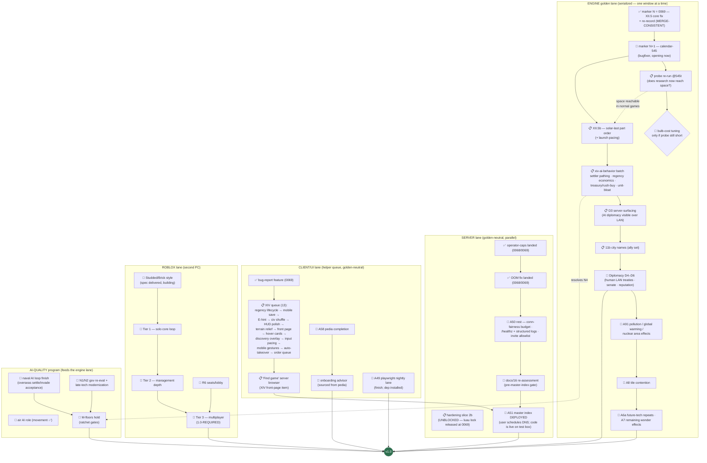

# RetroMultiCiv — road to v1.0: remaining work, as a dependency tree

_LIVING DOCUMENT (user ruling 2026-07-20): kept current as markers land —
update the node statuses + "last updated" line with each marker report, and
re-verify against the engine (not the workitem files) when an axis flips to
done. Companion: `plan-version2.md` (the v2.0-or-later shelf).
Last updated: 2026-07-20 (marker-0069 — XII.5 core fix MERGE-CONSISTENT; calendar-545 = marker N+1 opening). Source of truth for the 1.0
definition: `docs/03-roadmap.md` § "The 1.0 definition" (user-ruled, maximal
cut). Status legend: ✅ done · 🔨 in flight right now · 📋 queued (owner
known) · 🧩 designed, not started · 🚪 user gate._

The single most important structural fact: **every engine/gamesim change
serializes through ONE golden window** (one lock-holder at a time, JS+Luau
twins re-recorded together). The left spine below is therefore a queue, not a
set of parallel tracks. Server, client-UI, and Roblox work run in parallel
because they are golden-neutral.

## What "done" already covers (no v1 work left)

Naval systems, air movement, goody huts (A4), caravan wonder-help (A83) AND
trade routes (A89 — `engine/trade.js`), unit obsolescence/upgrades (A63),
building sell (A86), era-scaled barbarians (A66), AI leaders (A59), space
race content (A76 — Apollo/parts/launch + screen; the AI now *uses* it via
XII.5), debug surface (A92), map types (A82a), sound, tech tree + glyphs,
diplomacy D1–D3 (D3 = marker-0064), crash resilience + ws-timeout (markers
0066/0067), public hosting on the test box with TLS + hardened posture, the
master-index CODE (announce protocol + probe + `badAddress` guard, tested).

## The six 1.0 axes, scored

| # | 1.0 axis (user ruling) | State | Remaining |
|---|---|---|---|
| 1 | Every Civ 1 system faithful | ~85% | **A91 pollution/warming/nukes**, **A8 tile contention**, A6a future-tech repeats, A7 wonder-effect stragglers |
| 2 | Diplomacy FULL D1–D6 | D1–D3 ✅ | **D4–D6** (human LAN treaties, senate, reputation) — after the engine queue drains |
| 3 | AI at M-targets | strong | naval-loop acceptance, air role, N1/N2 gov re-eval, N4 bloat/hoard (→ `xiv-ai-behavior`), M-floor ratchets green |
| 4 | Roblox Tier 3 multiplayer | Tier 0 ✅ | Tiers 1→2→3 + R6 seats; Studded style in flight |
| 5 | Public hosting + master index | box ✅, code ✅ | A50 rest, security re-assess, **user DNS gate**, "Find game" client browser |
| 6 | Maps/sound/pedia/advisor/CI | partial | A58 pedia completion → onboarding advisor; A49 playwright lane finish |

## Reading the tree — the three facts that matter

1. **The engine spine is the critical path.** Markers N and N+1 are ruled and
   in motion; everything behind them (XII.5b → AI-behavior → D3-surfacing →
   11b → D4–D6 → A91/A8/A6a/A7) inherits their pace. The calendar-545 probe
   is the one branch point: if 545 turns still doesn't reach space, a
   bulb-cost ruling re-enters the queue.
2. **Only two hard user gates exist besides marker merges:** scheduling DNS
   for the master index (axis 5), and the conditional bulb-tuning ruling.
   Everything else is agent-executable in order.
3. **Roblox Tier 3 is the least-started 1.0-required area** — Tiers 1–3 are
   specced (docs/13) but the lane is currently on visual parity (Studded).
   When the engine queue quiets, the roblox lane is where breadth is needed.

_Not in v1 (user-ruled v2 shelf): dedicated mobile UI, Civ4-style culture,
novelty map shapes, checkpointed saves, Blender/glTF fidelity pass. The XIV
mobile items above are UX fixes to the existing client, not the v2 mobile UI._
