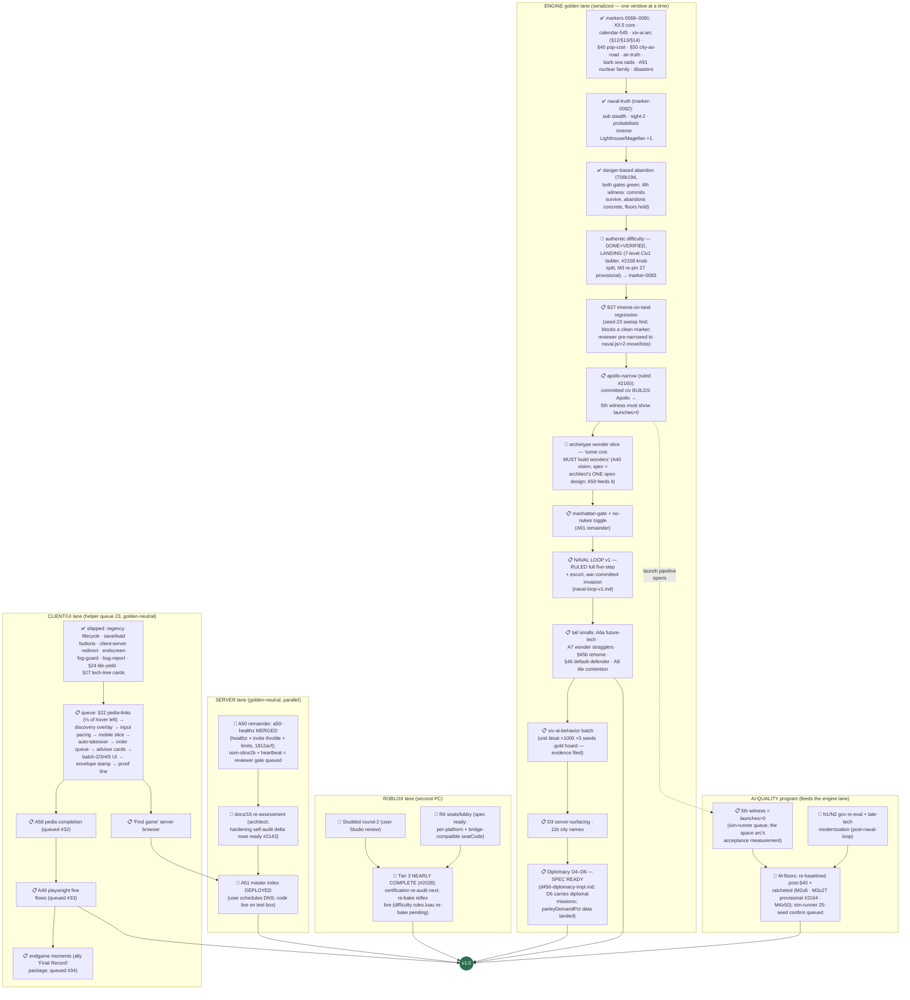

# RetroMultiCiv — road to v1.0: remaining work, as a dependency tree

_LIVING DOCUMENT (user ruling 2026-07-20): kept current as markers land —
update the node statuses + "last updated" line with each marker report, and
re-verify against the engine (not the workitem files) when an axis flips to
done. Companion: `plan-version2.md` (the v2.0-or-later shelf).
Last updated: 2026-07-22 (currency pass. marker-0082 = merge candidate;
0083 assembles: danger-abandon ✅ + hardening a50-healthz merge ✅ +
difficulty DONE+VERIFIED landing now [M3 floor 28→27 provisional #2164].
Engine order ruled #2160: difficulty-land → B27 trireme regression →
apollo-narrow → 5th witness [launches] → archetype wonder slice [spec =
architect's one open design] → manhattan-gate → naval-loop → smalls →
D4–D6. Space arc: danger-abandon criteria MET in the 4th witness; sole
remaining blocker = wonders never built [Apollo gate], staged-both ruled.)
Source of truth for the 1.0 definition: `docs/03-roadmap.md` § "The 1.0
definition" (user-ruled, maximal cut). Status legend: ✅ done · 🔨 in
flight right now · 📋 queued (owner known) · 🧩 designed, not started ·
🚪 user gate._

The single most important structural fact: **every engine/gamesim change
serializes through ONE golden window** (one lock-holder at a time, JS+Luau
twins re-recorded together). The left spine below is therefore a queue, not a
set of parallel tracks. Server, client-UI, and Roblox work run in parallel
because they are golden-neutral.

## What "done" already covers (no v1 work left)

Naval systems + naval TRUTH rules, air movement + air-truth rules, goody
huts (A4), caravan wonder-help (A83) AND trade routes (A89), unit
obsolescence/upgrades (A63), building sell (A86), era-scaled barbarians
(A66) + barbarian SEA RAIDS with the sails telegraph, AI leaders (A59),
the full A91 nuclear family (pollution · warming · meltdown · detonation),
the 8 Civ1 disasters (authentic-ON + toggle), settler pop-cost (§40),
city-as-road (§50), space race content (A76) with the XII.5b project AI +
danger-based abandon, the 7-level authentic difficulty ladder (landing),
debug surface (A92), map types (A82a), sound, tech tree + glyphs,
diplomacy D1–D3, crash resilience + ws-timeout, /healthz + invite
throttle, public hosting on the test box with TLS + hardened posture, the
master-index CODE (announce protocol + probe + `badAddress` guard, tested).

## The six 1.0 axes, scored

| # | 1.0 axis (user ruling) | State | Remaining |
|---|---|---|---|
| 1 | Every Civ 1 system faithful | ~92% | **B27 regression fix**, manhattan-gate + no-nukes toggle, A6a future-tech repeats, A7 wonder stragglers, A8 tile contention, §45b rehome, §46 default-defender |
| 2 | Diplomacy FULL D1–D6 | D1–D3 ✅, parley data landed | **D4–D6** (human LAN treaties, senate, reputation) — spec ready, after the engine queue drains |
| 3 | AI at M-targets | floors ratcheted green | **apollo-narrow + 5th witness (launches)**, archetype wonder slice, naval-loop acceptance, xiv-ai-behavior (bloat/hoard), gov re-eval |
| 4 | Roblox Tier 3 multiplayer | Tiers 0–3 effectively ✅ | certification re-audit; difficulty rules re-bake; Studded round-2 on user review; R6 build |
| 5 | Public hosting + master index | box ✅, code ✅, A50 nearly ✅ | oom-slice2b + heartbeat merges, docs/16 re-assess, **user DNS gate**, "Find game" browser |
| 6 | Maps/sound/pedia/advisor/CI | partial | advisor hint cards (queued), A58 pedia completion (queued), A49 playwright lane (queued) |

## Reading the tree — the three facts that matter

1. **The engine spine is the critical path and its order is fully ruled**
   (#2160/#2164): land difficulty → B27 → apollo-narrow → archetype →
   manhattan-gate → naval-loop → smalls → D4–D6. The space arc's research
   question is CLOSED (eligibility reached in 24/25 seeds at 545t); the
   wonder-building blocker has a ruled two-stage fix; the 5th witness is
   the arc's acceptance measurement.
2. **Only one hard user gate remains besides marker merges/redeploys:**
   scheduling DNS for the master index (axis 5). The bulb-tuning gate
   dissolved (calendar-545 + XII.5b path-research closed it). Everything
   else is agent-executable in order.
3. **The one open design is the archetype wonder spec** (architect,
   before its window; A59 personality work feeds it, ally input invited).
   Client/server/roblox lanes are fully specced and queue-fed.

_Not in v1 (user-ruled v2 shelf): dedicated mobile UI, Civ4-style culture,
novelty map shapes, checkpointed saves, Blender/glTF fidelity pass, the
Civ2-ruleset game option, cross-play bridge, negotiation layer, rename
program. The XIV mobile items above are UX fixes to the existing client,
not the v2 mobile UI._
