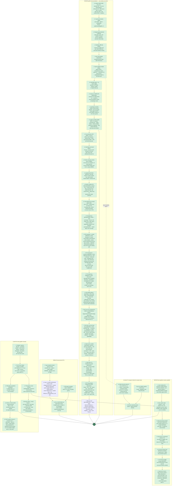

# RetroMultiCiv — road to v1.0: remaining work, as a dependency tree

_LIVING DOCUMENT (user ruling 2026-07-20): kept current as markers land —
update the node statuses + "last updated" line with each marker report, and
re-verify against the engine (not the workitem files) when an axis flips to
done. Companion: `plan-version2.md` (the v2.0-or-later shelf).
Last updated: 2026-07-30 — **marker-0110 TAGGED @dac46ec = MERGE-CONSISTENT
(supersedes 0109): W7 NOVELTY MAP SHAPES + the A91c warming/stranding repair.**
Five new shapes (fractal/oval/ring/inland-sea/clover) via a wrap-aware integer
mask stage; clover ships WITH balanced petal starts (measured: stock finder gave
2-3 distinct petals of 4, the round-robin gives 4/4 across 20 games). A91c: a
greenhouse turning ocean to swamp under a fleet now wrecks the hull and BEACHES
the cargo (user ruling). Gates: reviewer clean-clone + INDEPENDENT lune repro
PASS, additivity sweep 24/25 (the one FAIL is the documented pre-existing seed-19
tripwire), STAMP-ONLY, natural 545/p2 held a fifth time.
**W8 — THE LAST ENGINE WINDOW — IS IMPLEMENTED (@c074384 + coverage fixes).**
The econ pair: offensive diplomat (tech-lag steal, assault-prep sabotage) and
caravan doctrine (wonder chain, peace-economy routes), AI brain only. The
coverage run then caught the doctrine half-inert in play — ~94 diplomat missions
for 2 ACCEPTED steals (once-per-city immunity) and 624 route commands for ZERO
routes (the 10-tile domestic distance rule) — both fixed, with the rules now
encoded in fixtures (13/13). Gates open. **Title ruled + shipped: the browser and
mobile start screen is now "A World Begun" with "Project RetroMultiCiv" linking
to the repo, matching the Roblox client.**
--- prior: 2026-07-28 — **marker-0109 TAGGED = MERGE-CONSISTENT
(supersedes 0108): THE W6 BUILD-DOCTRINE WINDOW IS COMPLETE.** Slices
3 (city roles + the v1 war pair: siege pillage + air doctrine) @692ca7e,
4 (frontier defence; garrisonNeed consolidated to ONE formula at all
three floors) @d5007db, 5 (wonder host city; the first stamp-free W6
slice) @be01b87. Natural 545/p2 held across all four W6 re-records.
Coverage by direct count over 3 canonical seeds / 428 cities: walls
border 75.0% vs interior 32.8%, barracks 239 / library 215 /
university 12, air arms alive at t400, wonders +32% vs the pre-slice
reference. Gates: reviewer pristine clean-clone CODE GREEN at be01b87
(#2842, both engines reproduce every pin; the lone RED is the recurring
parallel-load false-red, isolation-proven), sim-runner sweep aggregates
baseline-comparable with floors safe (#2841; last 6 seeds + witnesses
re-queued after a duplicate job starved them). One new sweep finding —
seed 6 "sea unit on land" — ROOT-CAUSED as a pre-existing A91b warming
edge (`ocean`→`swamp` under a fleet), fixture-proved, fix landing in
its own gated window. **NEXT: W7 (novelty map shapes) opens.**
--- prior: 2026-07-27 (2nd) — **SCOPE RULING (user): the v1 engine
program EXTENDS to W6 → W7 → W8.** **W7 = novelty map shapes** (one
ADDITIVE golden window: fractal + oval + ring/donut + inland-sea +
clover-with-balanced-starts; toroidal wrap DEFERRED to v2; cylindrical
+ flat already exist via `map.wrapX`) — `specs/map-shapes-w7.md`.
**W8 = unit-doctrine ECON PAIR promoted from v1.x** (offensive
diplomat doctrine + caravan doctrine — AI brain only, the D6/A83/A89
mechanics already ship; counter-espionage stays v1.x as a Civ2
civ-mixing decision) — `specs/unit-doctrine-v1x.md` scope note 2.
**Nukes stay v1.x** pending the marathon measurement lane. **GHCR
image = flip + test at RC** (release-checklist step 4b). Estimated
+~1 week on the 1.0 path, accepted by ruling.
--- prior same day: post-0108 refresh (no new marker;
**0108 @6796e2e remains the merge candidate**). **W6 SLICE-2 RULED
FOLDED into slice-3** (user 2026-07-26): target pre-achieved —
measured organic 46 libraries + 32 markets + 6 universities across
139 cities, tree exhaustion + Future Tech by t400 (@c18220e) — a
golden window saved. **W6 now = slices 3–5, slice-3 OPEN**
(architect): city-role assignment + the v1 WAR PAIR (pillage-siege +
air-war — user unit-doctrine ruling; econ pair + nukes shelved v1.x,
`specs/unit-doctrine-v1x.md` with the banked #2798 authenticity
verdicts: counter-espionage=Civ2, pillage-siege=recalled-behavior).
ALSO since 0108: sim-runner Gate-B corroboration landed (uniform
23-seed recovery; peace-witness seed-2 exact-match); Roblox
1.0-parity close-stack FULLY LANDED (batch 1 @80b42b8 + tooltip
item-5 closed by ruling); **32 sound assets USER-APPROVED + upload
AUTOMATED** (`tools/render-sounds.js`/`.md` + `roblox/tools/
upload-sounds.js` @e69cb36 — the Studio sound item collapses to one
API key + one script); B13 witness regenerated (last local red
retired); concept-coverage audit: WAR_DECLARED=0 is
correct-by-design (implicit-hostility default, declarations =
treaty-breaks only, @d817df6).
--- prior: **marker-0108 TAGGED @6796e2e =
MERGE-CONSISTENT** (supersedes 0107). **W6 SLICE-1 COMPLETE** — the
build-doctrine + garrison-discipline arc (1a doctrine → 1b/1c
calibrations → 1d garrison role discipline, all user-ruled at the
forks). THE NUMBERS: M3-pop median 15.5→**62** (floor 22 —
RE-RATCHETED into nightly), M2-cities 4.25→**16**, M4-impr **91.5%**,
temple/granary coverage 0→**57.3%** (reviewer direct count, 7×), city
count 5.7×; sweep 25/25 (2 false-fails were a checker gap — ss-part
was a legal kind the invariant never learned: THE SPACE RACE IS LIVE
IN SWEEPS for the first time). Reviewer CLEAN ×2 (code + coverage);
twins 11/11 (caught a twin nil-call pre-push). Peace witness (user
design, chinese+germans defensive pair) = the acceptance instrument:
124 cities/18% coverage where pre-1d was 2 cities/0 buildings. ALSO:
Roblox 1.0-parity ruling + appendix (docs/13) with close-stack batch 1
LANDED @80b42b8; runtime finding (soak 3.5→36min — denser worlds).
Remaining W6: slices 2–5 (science/trade → roles → walls → wonders).
reports/marker-0108.md.
--- prior: **marker-0107 TAGGED @8c50ceb =
MERGE-CONSISTENT** (supersedes 0106 as the merge candidate). **W4
We-Love-the-King-Day @b813bbc, BOTH GATES GREEN**: reviewer #2753
(clean-clone 959/956/0-fail; the behavioral signature t100-held +
200-400-moved reproduced under lune = anti-paste-back proof; the natural
winner-flip 365/p3 verified a DETERMINISTIC butterfly, byte-identical
JS==Luau) + sim-runner #2755 (25-seed sweep 25/25 clean, no invariant
regression). Civ1-faithful (user-ruled): celebrate flag at the wrap →
corruption 0 (all govs) + Rep/Dem +1 trade on trading tiles; no rapture.
Scenario 067 pin 0x56151fa5 JS==Luau. Riders: **W5 re-home relabel
@a5b5808** (comment-only, both twins) + **WLTKD client surface @8c50ceb**
(bugfixer: turnlog rows + celebrate banner + overview 🎉, fog-honest) +
roblox GATE-4 re-bake @87fd953. Engine program **5 of 6 windows done —
only W6 build-doctrine remains**. W6 baseline MEASURED (#2746):
improvement doctrine inert — 0 temples/656 cities, 0.61% any-building,
M3-pop 20<22 breach — slice-1 starts from empty. reports/marker-0107.md.
--- prior: **marker-0106 TAGGED @6cad106 =
MERGE-CONSISTENT** (supersedes 0105 as the merge candidate). Adds **W3
score happy-citizen term DONE @aa6197e** (scoreBreakdown +happy =
happyCitizens*scorePerHappy, spec §10; pollution deferred off-in-v1) +
golden-neutral roblox W3 re-bake @6cad106. STAMP-only (score not hashed,
AI doesn't read it → only endYear score-winner is a trajectory surface,
unchanged); reviewer GREEN #2741 (engine-diff + working-clone score/sim/
age + twins 11/11 under lune; pristine clean-clone + 400-turn Luau
deferred per user, high-confidence parity). Engine program now **3 of 6
windows done** (W4 We-Love-the-King-Day next). reports/marker-0106.md.
--- prior: marker-0105 @b05a934 covered the
first two engine-program windows: **W1 diplomacy DONE @9dfc975**
(bugfixer — discovered-sabotage + investigateCity, reviewer-gated #2724)
and **W2 building effects DONE @a7f9da7** (architect — Mfg. Plant +100%/
obsoletes-Factory + SDI nuke-intercept, reviewer-gated #2736 @df90536f).
Both STAMP-only: the reviewer EMPIRICALLY verified stamp-only via
independent lune repro (BEHAVIOR_SOAK/NATURAL byte-identical to D5/W1;
the AI-buildable Mfg. Plant risk checked + cleared), clean-clone --full
954/951/0-fail. Two golden-neutral batches ride on top: **roblox W2 data
re-bake @fcfc574** (sim-runner) + **mobile-session-3 client @b05a934**
(helper, interaction cluster + #11 + #15). New cross-language scenario
066-sdi-intercept (0x7d67d913 JS==Luau). Report: `reports/marker-0105.md`.
Remaining v1 ENGINE program (`specs/engine-program-v1.md`): **W3 score
term · W4 We-Love-the-King-Day · W5 re-home relabel · W6 build-doctrine**
(PROMOTED, 5 slices, architect, LAST — clears the M3-pop advisory).
Golden windows serialize to the architect (one lock; W3/W4/W6 all ripple
the shared createGame stamp — cannot parallelize in the shared dev-PC
tree). USER GATES: merge 0105, redeploy, roblox/** Write allowlist,
Studio session (closes axis 4), trademark. Prior context: marker-0104
@bbfa85c closed the D4–D6 diplomacy arc (axis 2); the ally accepted
0103 in full (specials + Founder's Record tone, final); the conquest
world-brighten renderer upgrade is banked as a non-blocking v1.x item.
Source of truth for the 1.0 definition: `docs/03-roadmap.md` § "The 1.0
definition" (user-ruled, maximal cut). Status legend: ✅ done · 🔨 in
flight right now · 📋 queued (owner known) · 🧩 designed, not started ·
🚪 user gate._

The single most important structural fact: **every engine/gamesim change
serializes through ONE golden window** (one lock-holder at a time, JS+Luau
twins re-recorded together). The left spine below is therefore a queue, not a
set of parallel tracks. Server, client-UI, and Roblox work run in parallel
because they are golden-neutral.

```mermaid
flowchart TD
  subgraph ENGINE["ENGINE golden lane (serialized — one window at a time)"]
    HIST["✅ markers 0069–0081: XII.5 core ·\ncalendar-545 · xiv-ai arc (§12/§13/§14) ·\n§40 pop-cost · §50 city-as-road · air-truth ·\nbarb sea raids · A91 nuclear family · disasters"]
    NAV2["✅ naval-truth (marker-0082):\nsub stealth · sight-2 · probabilistic\ntrireme · Lighthouse/Magellan +1"]
    DAB["✅ danger-based abandon (706b19d,\nboth gates green; 4th witness: commits\nsurvive, abandons concrete, floors hold)"]
    DIFF["✅ authentic difficulty (0083):\n7-level Civ1 ladder; M3 floor RESTORED 28\n(25-seed evidence #2181)"]
    B27["✅ B27 fixed (0083): disbandCity\nstranded docked ships (§40 interaction)"]
    APN["✅ space pipeline repairs (0084):\napollo-narrow · manhattan/no-nukes ·\nradius fix — witnesses 5+6 still 0-launch;\n🚪 RESEARCH-DEPTH fork with user"]
    ARCH["✅ archetype wonders (0090): stance-keyed\nappetite + ally 22-wonder map; judge ACCEPT\n(non-builder wonders 0->20, floors green)"]
    MAN["✅ manhattan-gate + no-nukes toggle\n(landed in the 0084 window; verified\nin engine/cities.js)"]
    NAVL["✅ naval arc COMPLETE (0085-0092):\npresence-1/2 judge PASS ~2x + invade-B +\nformal acceptance 25/25 archipelago seeds"]
    SMALL["✅ smalls CLOSED (0088-0097): A7 wonders ·\npyramids-gov · settler-refuse + rehome (0095) ·\ndisorder-lux playbook · §46 default-defender ·\nA6a future-tech (0097)"]
    XAB["✅ xiv-ai-behavior #30 (0091) + gov arc\n(0094, bloat halved) + workers>pop + COW\nmap-sharing (0096, ~38% perf byte-identical)"]
    CLM["✅ claimSeat command (0097):\nAI seat -> human via the stamped command\npath; fixture 061; unblocked late-join §3"]
    A8N["✅ A8 tile contention (0102, fork-b 376ff03):\nonce-per-turn resolution, AI evals keep the\npre-A8 model (ruling); perf 0.53×; sweep GREEN"]
    CST["✅ coastal-build (0102, 95261a1): sea units\nrequire a center-coastal city; cityIsCoastal\nshared helper; scenario 064"]
    RIV["✅ RIVER COMPLETE (0103 @fe39360): landed +\nfix-A + sweep clean; M3 floor re-pinned 22 by\nUSER RULING; ally ACCEPTED + edge-seam fix\nlanded same night (c1f0cea)"]
    D11["✅ 11b authentic city rosters (@5617bf9):\nall 14 civs -> dump-exact 16-name Civ1\nfounding order; honest behavioral+stamp\nre-record; twins 76/76"]
    D4S["✅ D4 diplomacy (@ceda2169e): tribute + tech\nexchange + human LAN treaty cmd + offer expiry;\ntreaty-UI parley->diplomacy rename; NOT TAGGED\n(overnight policy — batch-tags in the morning)"]
    D5S["✅ D5 reputation + senate (@fe023c0, 0104):\nreputation 0-4 band (recoverable, byte-identical\nwhen healed) · senate blocks Republic/Democracy\nwar-on-peace · UN/Great Wall peaceAcceptBonus;\nfixes the D4 event-catalog gap"]
    D6S["✅ D6 embassies + missions (@984f48c, 0104):\ndiplomat-missions.js + twin — embassy + steal-tech\n(roll) + sabotage (roll) + incite + bribe; filterView\nembassy intel view-only. GOLDEN-NEUTRAL. Scenario\n065 pin 0xea7216fc JS==Luau. ARC COMPLETE"]
    W1E["✅ W1 diplomacy (@9dfc975, 0105): discovered-\nsabotage (botch-amplified discovery + reputation) +\ninvestigateCity re-apply; 065 behavioral 0x8771d49a;\nSTAMP-only cascade; twins 11/11"]
    W2E["✅ W2 building effects (@a7f9da7, 0105): Mfg.\nPlant +100%/obsoletes-Factory + SDI nuke-intercept\n(rollRange<70); STAMP-only (reviewer lune-verified\nBEHAVIOR byte-identical); scenario 066 0x7d67d913"]
    W3E["✅ W3 score term (@aa6197e, 0106): scoreBreakdown\n+happy = happyCitizens*scorePerHappy (spec §10);\nSTAMP-only (reviewer GREEN #2741); pollution\ndeferred off-in-v1"]
    W4E["✅ W4 We-Love-the-King-Day (@b813bbc, 0107):\ncelebrate flag → corruption 0 + Rep/Dem +1 trade;\nBEHAVIORAL (natural 545→365 p3, deterministic\nbutterfly); both gates GREEN; + W5 relabel @a5b5808"]
    W6S1["✅ W6 SLICE-1 (0108 @6796e2e): doctrine +\ngarrison discipline — M3 62 (4x floor, RE-RATCHETED) ·\ncoverage 0→57% · cities 5.7x · space race LIVE in\nsweeps · sweep 25/25 · reviewer CLEAN x2"]
    W6E["✅ W6 slices 3-5 COMPLETE (0109 @be01b87):\ncity roles + war pair (siege pillage + air) ·\nfrontier walls (garrisonNeed consolidated) ·\nwonder host; walls border 75% vs interior 33%"]
    W7E["✅ W7 map shapes COMPLETE (0110 @dac46ec):\nfractal · oval · ring · inland-sea · clover WITH\nbalanced petal starts (4/4 petals, 20 games);\nSTAMP-ONLY · sweep 24/25 · A91c repair rides"]
    W8E["🔨 W8 econ pair IMPLEMENTED — gates open:\ndiplomat steal/prep + caravan chain/routes;\ncoverage caught 2 defects (immunity, route\nlegality) — fixed, 13/13 fixtures"]
    HIST --> NAV2 --> DAB --> DIFF --> B27 --> APN --> MAN --> NAVL
    NAVL --> ARCH --> SMALL --> XAB --> CLM --> A8N --> CST --> RIV --> D11 --> D4S --> D5S --> D6S
    D6S --> W1E --> W2E --> W3E --> W4E --> W6S1 --> W6E --> W7E --> W8E
  end

  subgraph SERVER["SERVER lane (golden-neutral, parallel)"]
    A50R["✅ A50 COMPLETE (reviewer-verified #2225):\naudit-fixes f0e03b1; oom-slice2b 579ba2e +\nheartbeat b4b9dcd merged since 0083, gated #2165"]
    A51D["✅ A51 master index PUBLIC + LIVE\n(2026-07-23: cert expanded, servers. block\ninstalled, index answering — axis 5 CLOSED)"]
    LJS["✅ late-join+pause+eviction FEATURE-COMPLETE\n(user design 2026-07-24 -> merged @205bbfe\nsame day; --no-late-join documented)"]
    SEC2["✅ docs/16 §7 re-assessed (2026-07-24,\nnew-dep+1.0 trigger): NO RC-blocker;\ntakeover-cap residual -> v2 shelf"]
    VCT["✅ #19 view-contract test MERGED (012d04b)\n+ master-proxy + lobby-drop (reviewer green)"]
    JTG["✅ XVII §3 join-toggle merged @e00be57\n(host open/closed, AI-seat auto-fill,\nreconnect-reclaim verified)"]
    GOR["✅ gameover-reveal + reject-reasons (0102) +\nlobby-robustness + docs/16 §8 delta + the\nendscreen-winner view contract ALL MERGED (0103)\n— server lane queue EMPTY"]
    A50R --> A51D --> LJS --> SEC2 --> VCT --> JTG --> GOR
  end

  subgraph CLIENT["CLIENT/UI lane (golden-neutral)"]
    XIVD["✅ shipped: regency lifecycle · save/load\nbuttons · client-server redirect · endscreen\nfog-guard · bug-report · §24 tile-yield ·\n§27 tech-tree cards"]
    XIVQ["✅ the 30-item helper window CLOSED\n(XIV batches 2-5 + XV set + A58 + off-turn\nover-server + gov-picker; queue EMPTY)"]
    A58["✅ A58 pedia completion (2d4a8d1):\n0 catalog gaps + 3 concepts, reviewer\ncross-checked"]
    A49["✅ A49 ALL FIVE FLOWS specced (0103):\nflow-4 = test-ui/endscreen.spec.js, doubles\nas regression-guard 3"]
    LJC["✅ late-join client + reveal banner +\njoin-share QR + boot-fade + specials motifs\n+ d4-treaty-shell + play-lane sweep +\nrefinement-XVII (0101) + XIX 8/8 (0102)"]
    END["✅ #34 Founder's Record + founders-tone +\nsilhouettes + play-on-roblox + pedia-splash\n(Encyclopedia) ALL SHIPPED (0103); guards\nG1-G5 complete; helper queue: oasis-palm"]
    FG["✅ 'Find game' server browser\n(initGlobalTab: checksum-honest listing,\npick re-points the join flow)"]
    XIVD --> XIVQ --> A58 --> A49 --> END
    XIVQ --> FG
    FG --> LJC
  end

  subgraph ROBLOX["ROBLOX lane (second PC)"]
    T3["✅ Tier 3 CERTIFIED (re-audit PASS #2222:\n29 gates green, re-bake in-tree 06448dd;\nverdict artifact roblox/acceptance/tier3-cert.md)"]
    SNAP["✅ age-snapshot instant starts ACTIVE\n(matcher twin + loader + roster-shuffle\n8f0e982) · specials mirror 577086c"]
    STUD["✅ intro v1 USER-APPROVED frozen at v5b ·\nmidgame-join BUILT + landed 58f74e4 (claimSeat\nparity, toggle default on) · 🚪 Studio session:\nverify midgame-join + publish gate + set\nROBLOX_EXPERIENCE_URL after"]
    R6["✅ R6 agent-complete (slice-1 de8a977 +\nslices 2-3 in-tree; 30 gates green)"]
    STUD --> T3
    R6 --> T3
    SNAP --> STUD
  end

  subgraph AIQ["AI-QUALITY program (feeds the engine lane)"]
    MFL["✅ M-floors ratcheted green\n(M2≥6 · M3≥28 restored · M4≥50)"]
    W5["✅ FORK RULED (2026-07-24): ACCEPT for v1\n— space = authentically-contested ending;\nwitness-8 re-measure queued post-D4\n(sim-runner, durable)"]
    GOV["✅ gov arc (0094): beeline + democracy-\nif-safe + upgrade-in-city; bloat HALVED"]
    W5 --> MFL
    GOV --> MFL
  end

  A51D --> V1
  T3 --> V1
  W8E --> V1
  SMALL --> V1
  MFL --> V1
  A49 --> V1
  FG --> A51D
  APN -. "launch pipeline\nopens" .-> W5
  V1(("v1.0")):::goal

  classDef goal fill:#2f6f4f,color:#fff,stroke:#2f6f4f
  classDef done fill:#d9f2e0,color:#1c4a33,stroke:#7bc09a
  class HIST,NAV2,DAB,DIFF,B27,APN,ARCH,MAN,NAVL,SMALL,XAB,CLM,A8N,CST,RIV,D11,D4S,D5S,D6S,W1E,W2E,W3E,W4E,W6S1,W6E,W7E done
  class A50R,A51D,LJS,SEC2,VCT,JTG,GOR done
  class XIVD,XIVQ,A58,A49,LJC,FG,END done
  class T3,SNAP,R6 done
  class MFL,W5,GOV done
```

## What "done" already covers (no v1 work left)

Naval systems + naval TRUTH rules, air movement + air-truth rules, goody
huts (A4), caravan wonder-help (A83) AND trade routes (A89), unit
obsolescence/upgrades (A63), building sell (A86), era-scaled barbarians
(A66) + barbarian SEA RAIDS with the sails telegraph, AI leaders (A59),
the full A91 nuclear family (pollution · warming · meltdown · detonation),
the 8 Civ1 disasters (authentic-ON + toggle), settler pop-cost (§40),
city-as-road (§50), space race content (A76) with the XII.5b project AI +
danger-based abandon, the 7-level authentic difficulty ladder (landing),
debug surface (A92), map types (A82a), sound, tech tree + glyphs,
diplomacy D1–D3, crash resilience + ws-timeout, /healthz + invite
throttle, public hosting on the test box with TLS + hardened posture, the
master-index CODE (announce protocol + probe + `badAddress` guard, tested).

## The six 1.0 axes, scored

| # | 1.0 axis (user ruling) | State | Remaining |
|---|---|---|---|
| 1 | Every Civ 1 system faithful | **RIVER COMPLETE (0103)** — all terrains in, floors re-baselined by ruling | workturns/transforms companion (banked) |
| 2 | Diplomacy FULL D1–D6 | **✅ COMPLETE** — D1–D3 ✅, 11b ✅, D4/D5/D6 all LANDED + TAGGED (marker-0104) | — (axis closed) |
| 3 | AI at M-targets | **✅ W6 COMPLETE (0109) + W8 econ pair implemented (gates open)** — slice-1 numbers hold (M3-pop 62 = 4× floor, M2 16, M4 91.5%, coverage 0→57.3%) and slices 3–5 add city roles + the war pair + frontier walls + wonder hosting: walls border 75.0% vs interior 32.8%, barracks 239/library 215 across 428 cities, air arms live, wonders +32%; reviewer clean-clone GREEN, sweep aggregates baseline-comparable | **W8 econ-pair doctrine** (after W7) — the last engine window before RC |
| 1b | Civ1 feature faithfulness (audit) | **✅ CLOSED (0107)** — W1 ✅ + W2 ✅ + W3 ✅ + W4 WLTKD ✅ (gates GREEN) + W5 relabel ✅ | — (axis closed) |
| 4 | Roblox Tier 3 multiplayer | CERTIFIED + intro v1 APPROVED (frozen v5b) + midgame-join landed + **1.0-parity close-stack FULLY LANDED** (batch 1 @80b42b8, item-5 closed) + sound upload AUTOMATED (@e69cb36) | 🚪 the ONE Studio session (verify midgame-join + publish + URL const + API-key sound upload + store art/genre) |
| 5 | Public hosting + master index | ✅ COMPLETE + LIVE; lobby-robustness + docs/16 §8 merged | — (server lane queue empty) |
| 6 | Maps/sound/pedia/advisor/CI | advisor ✅, A58 ✅, Founder's Record + tone pass + silhouettes ALL ally-approved final, PEDIA_NAME=Encyclopedia ✅, **32 sound assets user-approved (2026-07-26)** | **✅ W7 map shapes SHIPPED (0110)** — nine types incl. clover with balanced starts; naval acceptance for the water-heavy shapes rides after (human-workitems B3) (`specs/map-shapes-w7.md`; the browser picker is already data-driven from `rules.mapTypes`, so the client half is ~zero); conquest renderer-brighten banked v1.x; guards G1–G5 + A49 5/5 all complete |

## Reading the tree — the three facts that matter

1. **The engine program now runs W6 → W7 → W8 (user scope ruling
   2026-07-27), and it is the critical path.** W1–W5 ✅ (0105–0107);
   **W6 ✅ COMPLETE (0108 slice-1 + 0109 slices 3–5); slice-2 FOLDED.**
   Then **W7 novelty map shapes** (additive window,
   `specs/map-shapes-w7.md`: fractal/oval/ring/inland-sea/clover;
   toroidal deferred) and **W8 econ-pair doctrine** (offensive
   diplomat + caravan AI brain; nukes stay v1.x pending marathon).
   Accepted schedule cost ≈ +1 week. Golden windows SERIALIZE to the
   architect — only the NON-golden portions (client halves, lobby
   pickers, pedia text) can be offloaded to an idle lane.
2. **Lane shape (current).** Helper stopped (clean park). Bugfixer
   idle post-B13-witness-regen, queue restocked (witness-generator
   promotion). Sim-runner back online: Gate-B corroboration landed;
   measurement batch queued (concept histograms, natural distribution,
   disasters-ON, peace-witness remainder — approved, never
   1.0-blocking). Reviewer idle; next gate = W6 slice-3. Roblox-helper:
   close-stack FULLY LANDED, waiting on the user Studio session.
   Hardening: SIGTERM-flake queue item (its exclusive files).
3. **User gates remain:** merge marker-0108 (@6796e2e, ready now,
   supersedes 0107), the trademark search, and the ONE Studio session
   — now shorter: publish + midgame-join verify + store art/genre +
   the scripted sound upload (one Open Cloud API key +
   `roblox/tools/upload-sounds.js`) + ROBLOX_EXPERIENCE_URL.

_Not in v1 (user-ruled v2/v1.x shelf): dedicated mobile UI, Civ4-style
culture, TOROIDAL wrap (the map SHAPES themselves are now v1 = W7),
checkpointed saves, Blender/glTF fidelity pass, the Civ2-ruleset game
option, cross-play bridge, negotiation layer, rename program, nuke
doctrine + diplomat counter-espionage (the econ pair is now v1 = W8;
`specs/unit-doctrine-v1x.md` scope note 2). The XIV mobile items above
are UX fixes to the existing client, not the v2 mobile UI._
